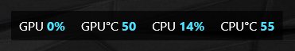

# Simple Game Overlay (SGO)

A lightweight, minimalistic overlay for Windows that displays real-time CPU and GPU load and temperature on top of your screen — including in fullscreen games.

## Screenshot

## Features
- CPU load and temperature
- GPU load and temperature
- Customizable text color, size, and position
- Global hotkey to toggle overlay visibility
- Runs in the background with a system tray icon
- Starts automatically with Windows

## Installation
1. Download the latest installer from the [Releases](https://github.com/Kubostrel/SimpleGameOverlay/releases) page
2. Run `Installer.msi` and follow the setup wizard
3. The app will start automatically and appear in your system tray
4. Right-click the tray icon and select "Settings" to customize the overlay

## Requirements
- Windows 10/11 (x64)
- Administrator rights (required to read hardware sensors)

## Built With
- C# / WPF (.NET 8)
- [LibreHardwareMonitorLib](https://github.com/LibreHardwareMonitor/LibreHardwareMonitor)
- WiX Toolset (installer)

## Building from source
1. Clone the repo
2. Open `SGO.sln` in Visual Studio 2022
3. Build in Release/x64 configuration
4. The installer will be generated in `Installer/bin/x64/Release/en-US/`

## Security
This project is fully open-source — feel free to review the code before installing.

## License
MIT License — see [LICENSE](LICENSE) file for details.